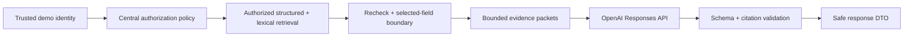

# Privato

> Digital vaults organize files. Privato organizes trust.

Privato is a private information network that helps families and close friends organize essential documents, insurance cards, medical details, emergency contacts, and household instructions around the people they trust.

This repository contains a polished Build Week MVP centered on a deterministic, relationship-aware access model: Core, Inner, and Outer Circles. The golden path demonstrates that authorized information is easy to find while restricted information is unavailable through vault browsing, pasted resource URLs, and Ask Privato.

<p align="center">
  
</p>
<p align="center"><sub><strong>One calm, permission-aware experience across desktop and mobile.</strong></sub></p>

## What is included

- Calm, responsive entry page and household dashboard
- Memorable concentric trust map plus an accessible membership list
- Rank-based inherited access with an owner-only Private level
- Demo identity preview for five synthetic household members
- Permission-filtered vault, protected detail routes, masking, audience preview, and audit history
- Insurance image/PDF upload with validation, server-side AI extraction, editable review, uncertainty, visibility recommendation, and explicit approval
- Manual resource-entry fallback
- Authorization-first Ask Privato retrieval with relevance ranking, minimal evidence, validated citations, revocable access, and non-disclosing empty responses
- Versioned AES-256-GCM encryption boundary and PostgreSQL encrypted-payload schema
- Drizzle schema, SQL migration, and database seed
- Timeout, transient retry, circuit breaker, correlation ID, safe AI-run metadata, and an honest unavailable state
- Focused tests for authorization, revocation, leakage resistance, decryption boundaries, encryption, structured AI output, citation integrity, and runtime failures

## Responsive by design

Preparedness does not happen only at a desk. Privato is designed to remain clear and usable whether someone is organizing the household on a laptop or looking up an insurance card from a phone at the moment it is needed.

<p align="center">
  
</p>
<p align="center"><sub><strong>The same trust model, optimized for focused mobile actions and full desktop workflows.</strong></sub></p>

- **Adaptive navigation:** the desktop sidebar becomes a persistent, thumb-friendly bottom navigation bar on smaller screens.
- **Intentional reflow:** hero content, readiness metrics, resource cards, trust-circle panels, forms, and review surfaces stack without losing their visual hierarchy.
- **Touch-ready controls:** primary actions retain generous targets, dialogs fit the viewport, and identity controls condense without hiding their purpose.
- **Readable sensitive data:** resource details, masked values, audience information, and citations remain legible without horizontal scrolling.
- **Consistent authorization:** responsive presentation never changes the underlying access policy; every device receives the same identity-aware filtering and protected-route checks.

## Architecture

Privato uses Next.js App Router, strict TypeScript, React server components by default, Tailwind CSS, PostgreSQL, Drizzle ORM, Zod, and the OpenAI server SDK.

The most important boundaries are kept independent:

```text
UI / route handlers
  -> application services
      -> identity provider
      -> centralized authorization policy
      -> resource / document ports
      -> AI gateway port
          -> OpenAI + bounded runtime controls for grounded Ask answers
          -> deterministic fallback for upload extraction only
```

The live demo defaults to an in-process synthetic repository so the judging path remains reliable without infrastructure. The included PostgreSQL schema, migration, encrypted seed, and repository boundaries establish the production persistence shape. See [architecture](docs/architecture.md) and [security model](docs/security-model.md).

## Local setup

Prerequisites:

- Node.js 20+
- pnpm 10+
- PostgreSQL 15+ only when exercising the database path

```bash
pnpm install
cp .env.example .env.local
pnpm dev
```

Open [http://localhost:3000](http://localhost:3000).

The synthetic vault, circles, resource browsing, manual resource creation, and deterministic upload-extraction demonstration work without PostgreSQL or an OpenAI key. A real grounded Ask Privato answer requires `OPENAI_API_KEY`; when it is absent, Privato does not fabricate an answer and instead shows its designed unavailable state. The no-authorized-evidence fast path remains functional without a key because it deliberately skips answer generation.

## Environment variables

| Variable | Required | Purpose |
| --- | --- | --- |
| `DATABASE_URL` | Database path only | PostgreSQL connection URL |
| `PRIVATO_MASTER_KEY` | Production-shaped DB path | 32-byte AES key encoded as 64 hex characters |
| `OPENAI_API_KEY` | Ask answer path | Enables live server-side OpenAI extraction and real grounded Ask Privato answers |
| `OPENAI_MODEL` | No | Model selected by the AI provider adapter; defaults to `gpt-4.1-mini` |
| `DEMO_SESSION_SECRET` | Future persistence | Reserved for replacing the bounded demo identity cookie with a signed session |

Generate a local encryption key with `openssl rand -hex 32`. If no key is configured, the synthetic local demo uses an explicit development-only key; database deployments should always configure one.

## Database

Create the configured database, then run:

```bash
pnpm db:migrate
pnpm db:seed
```

Schema iteration commands:

```bash
pnpm db:generate
pnpm db:push
```

The seed contains only obvious fictional names, masked identifiers, `555` phone numbers, and fictional institutions.

## Verification

```bash
pnpm lint
pnpm typecheck
pnpm test
pnpm build
```

## ElectriPy AI integration

[ElectriPy AI 0.5.0](https://www.electripy.ai/) is currently published as a Python 3.11+ package with the `electripy` import namespace, not as a supported Next.js TypeScript runtime package. Privato therefore does not fabricate an npm import.

The application isolates runtime control behind `AiRuntimePort` and `AiGatewayPort`. The active TypeScript `ResilientAiRuntime` implements hard timeouts, transient-only bounded retries with jitter, a circuit breaker, safe error categorization, and aggregate token metadata. It is not ElectriPy and the repository does not claim that ElectriPy executes in Vercel. A supported ElectriPy Python service can be placed behind the runtime boundary later without changing authorization or application services. Raw documents, questions, prompts, answers, and protected values are not emitted to telemetry.

## Ask Privato security sequence



The model never decides authorization. The server calculates authorized resource IDs first, retrieval is restricted to that set, and only selected authorized candidates cross the sensitive-field boundary. An empty relevant set returns the neutral no-answer response without invoking the answer model. Circle changes are read from a fresh server snapshot on each request, so effective access is revoked immediately.

The active retriever uses deterministic structured and lexical scoring over household-scale, approved searchable metadata. Embeddings are intentionally not enabled: there is no unrestricted vector search, no duplicate plaintext chunk store, and no pgvector claim. The `AuthorizedRetrieverPort` can accept a tenant-scoped embedding adapter later if corpus size warrants it.

## Honest prototype security statement

Privato is a security-minded prototype, not a production security certification. It does not claim HIPAA compliance, SOC 2 compliance, zero-knowledge encryption, or end-to-end encryption.

Implemented controls include centralized server-side authorization, cross-household denial, owner-only Private resources, direct-route rechecks, authorization before any sensitive read boundary, authorized-ID-scoped retrieval, server-only OpenAI calls with response storage disabled, Zod input/output validation, strict citation validation, a no-model fast path, upload limits and type checks, safe error messages, AES-256-GCM primitives, secure response headers, non-sensitive audit events, and safe aggregate AI-run records.

## Known limitations

- The default golden path uses an in-process demo repository; state resets with the server and is not suitable for multiple instances.
- Demo identity switching is explicitly a presentation feature, not production authentication.
- Real Ask Privato answers require a server-side OpenAI key and configured model. The repository's deterministic AI fallback remains limited to the clearly labeled upload-extraction demo and never fabricates Ask answers.
- Ask retrieval currently uses structured and lexical scoring rather than embeddings. It is appropriate for the tiny synthetic household corpus, not a large document collection.
- AI-run telemetry is recorded in the active in-memory demo store. The Drizzle schema and migration define the PostgreSQL persistence target, but the Vercel demo does not claim durable AI-run storage without a configured database adapter.
- Uploaded document bytes are validated and processed in memory, but the infrastructure-free demo stores only protected document metadata. Durable encrypted bytes require wiring `DocumentStoragePort` to PostgreSQL or object storage.
- PostgreSQL migration and encrypted seed are included, but the default screens do not require a running database.
- The fallback extractor produces stable synthetic fields for demonstration; configure OpenAI for document-aware extraction.
- Invitations, reminders, temporary grants, recovery, billing, and real document preview/download are intentionally outside the one-day scope.

See [the five-minute demo script](docs/demo-script.md) for the intended presentation flow.
