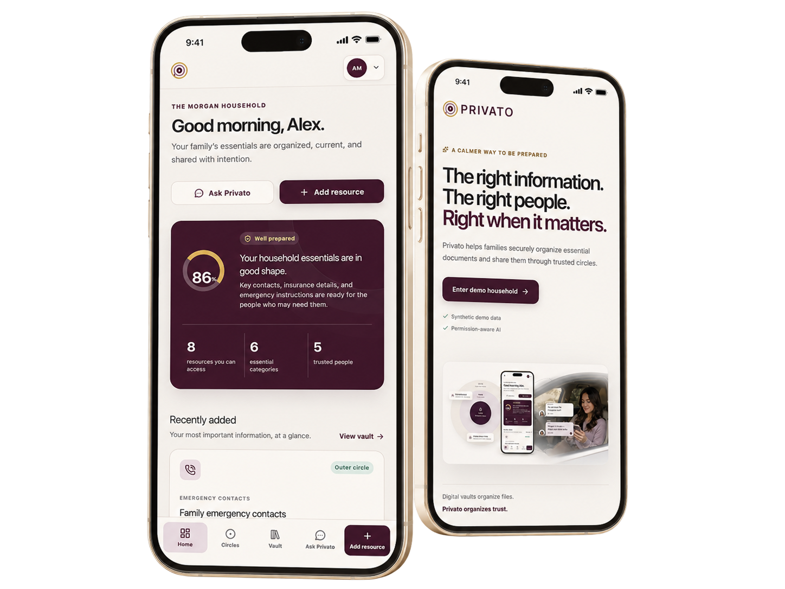

<p align="center">
  
</p>

# Privato

> Digital vaults organize files. Privato organizes trust.

Privato is a relationship-aware private information network that helps families and trusted contacts organize sensitive household information and retrieve it through revocable, permission-scoped AI.

Its signature capability, **Ask Privato**, provides revocable, identity-aware AI retrieval: the server resolves the active identity, calculates access with deterministic policy, retrieves only from that authorized scope, sends minimal evidence to OpenAI, and validates every citation before returning an answer.

**Authorization first. Retrieval second. AI last.**

<p align="center">
  <a href="https://privato-opal.vercel.app"><strong>Live application</strong></a>
  ·
  <a href="docs/architecture.md">Architecture</a>
  ·
  <a href="docs/security-model.md">Security model</a>
  ·
  <a href="docs/ask-privato-implementation.md">Ask Privato implementation</a>
</p>

<p align="center">
  
</p>
<p align="center"><sub><strong>One permission-aware experience across desktop and mobile, from household preparedness to protected retrieval.</strong></sub></p>

## Why Privato

Essential household information is usually fragmented across email, text messages, wallets, cloud drives, spreadsheets, and filing cabinets. The information may exist, but that does not mean the right person can find it at the right moment.

Traditional vaults organize documents. Families think in relationships and trust. Privato makes that access model visible through **Core**, **Inner**, **Outer**, and owner-only **Private** levels.

> If something happened tonight, would the right people know where everything is?

## The signature demonstration

The seeded Morgan household makes Privato's central idea observable with the same question, the same resource, and a changing authorization scope.

| Step | Identity and circle | Question | Verified result |
| ---: | --- | --- | --- |
| 1 | Alex Morgan · Core · resource owner | “What number do I call for roadside assistance?” | Grounded answer with a validated **Roadside Assistance** citation |
| 2 | Sam Rivera · Outer | The same question | Neutral no-answer; no evidence is selected and the answer model is not invoked |
| 3 | Sam moved to Inner | The same question | Grounded answer with the same authorized citation |
| 4 | Sam moved back to Outer | The same question | Access is revoked on the next request; neutral no-answer and no model invocation |

The neutral response is deliberately identical whether information is nonexistent, irrelevant, or outside the active identity's scope:

> I couldn’t find accessible information that answers that question.

The model does not decide what Sam may see. The same natural-language question produces a different result because Privato recalculates deterministic authorization before retrieval. Restricted resources never enter the answer model's context, and revocation applies without restarting the application or clearing a server-side conversation cache.

## Ask Privato

Ask Privato is **authorization-scoped grounded retrieval**, implemented as a bounded, single-turn server use case:

1. Resolve the active identity from the server-side demo session.
2. Rebuild current household membership and authorized resource IDs.
3. Run structured and lexical ranking only over approved records in that authorized set.
4. Re-resolve and re-authorize each selected candidate.
5. Cross the sensitive-field/decryption boundary only for selected authorized candidates.
6. Build minimal evidence packets with bounded fields, values, source IDs, and public resource IDs.
7. Invoke the OpenAI Responses API with strict Structured Outputs and response storage disabled.
8. Validate the response schema, every source/resource pair, and current citation authorization.
9. Construct citation URLs on the server and return a private, non-cacheable response.

The active demo repository contains synthetic plaintext fields in memory, so its `ResourceEncryptionPort` is an authorization-enforcing sensitive-read boundary rather than a runtime decryptor. The PostgreSQL schema defines encrypted payload columns, and its seed encrypts resource fields with the versioned AES-256-GCM implementation before insertion.

Ordinary document assistants often search a broad corpus and then control what is displayed. Privato constrains the corpus before relevant fields are read or evidence is sent to the answer model. AI assists within deterministic policy boundaries; it never widens them.

## Authorization pipeline


> **Authorization first. Retrieval second. AI last.**

OpenAI receives the question and only the evidence selected from Privato's authorized scope. It does not receive the household vault, membership graph, internal database IDs, inaccessible resource names, or authorization logic.

## How this answer was protected

Every Ask response includes a collapsible protection trace designed to make the safety path inspectable without exposing the underlying content.

| Safe trace field | What it communicates |
| --- | --- |
| Active identity and circle | Whose current server-side scope was evaluated |
| Authorized resource count | Size of the policy-approved scope |
| Candidates and sources | How many approved records were considered and cited |
| Policy decision | Allowed, no authorized evidence, insufficient evidence, or unavailable |
| Retrieval method | Structured and lexical ranking |
| Model invocation and model | Whether generation ran and which configured model handled it |
| Duration, retries, and circuit state | Bounded runtime behavior |
| Token usage | Aggregate input and output tokens when a model ran |
| Correlation ID | Short identifier for safe operational follow-up |

The trace intentionally excludes questions, prompts, decrypted evidence, answers, policy numbers, medical values, restricted resources, internal database IDs, and encryption keys.

When retrieval finds no relevant authorized evidence, Privato returns the neutral response with zero sources **without invoking the generative answer model**.

## Trust circles

Lower ranks are more trusted. A member inherits access outward; a resource never inherits inward.

| Level | Typical members | Effective access |
| --- | --- | --- |
| Private | Resource owner | Owner-only resources, regardless of the owner's circle |
| Core | Spouse or closest trusted person | Core, Inner, and Outer resources |
| Inner | Children or close family | Inner and Outer resources |
| Outer | Friends, caregivers, or advisors | Outer essentials only |

The centralized rule in [`policy.ts`](src/modules/authorization/policy.ts) is reused for dashboard and vault filtering, resource-detail and pasted-URL checks, effective-audience previews, selected sensitive-field reads, Ask Privato retrieval, and citation revalidation. Cross-household access fails before rank is considered.

## Core capabilities

- Household readiness dashboard with accessible-resource, category, member, expiration, and activity summaries
- Concentric trust-circle map with exact access-impact previews before a member moves
- Five-identity synthetic household preview with an explicit demo-authentication disclaimer
- Permission-filtered vault search, category filters, protected detail routes, and non-disclosing unavailable states
- Sensitive-value masking and user-controlled reveal behavior
- Effective-audience calculation from current ownership, membership, and visibility
- Insurance-card upload validation for PDF, JPEG, PNG, and WebP files up to 5 MB
- OpenAI structured extraction when configured, with editable review, uncertainty indicators, and advisory visibility recommendation
- Deterministic extraction fallback and manual-entry fallback for the infrastructure-independent demo
- Ask Privato grounded answers, server-validated citations, protection traces, and neutral no-answer behavior
- Safe in-memory audit events and AI-run aggregates that exclude protected content
- Versioned AES-256-GCM primitives, Drizzle schema, migrations, and encrypted PostgreSQL seed path
- Responsive desktop and mobile interface with Vercel Analytics

## Closed-loop AI workflow

The implemented insurance workflow is:

```text
Upload synthetic insurance document
  → validate type, extension, and size on the server
  → OpenAI structured extraction or labeled demo fallback
  → validate with Zod
  → review and edit every field
  → approve visibility and effective audience
  → save structured resource + attachment metadata to the in-process demo store
  → make the resource available to authorized vault and Ask requests
  → return grounded answers with validated citations
```

The model may recommend visibility, but it cannot authorize or save a resource. Uploaded bytes are processed in memory and are **not retained** by the active demo; only reviewed structured fields and attachment metadata are stored in process. Use synthetic documents only. Durable encrypted document storage is represented by `DocumentStoragePort` and the PostgreSQL schema but is not wired into the Vercel runtime.

## Security invariants

- **The model never decides authorization.** The single policy function decides access before retrieval or sensitive reads.
- The Ask request accepts only a bounded question; it cannot supply a household, actor, circle, or resource ID.
- The demo identity cookie is resolved against current seeded membership on the server. It is a preview mechanism, not production authentication.
- Cross-household access is denied before trust rank is evaluated.
- Private resources remain owner-only.
- Retrieval receives an authorized ID set and can query only corresponding approved search records.
- Every selected candidate is re-resolved and re-authorized before crossing the sensitive-field boundary.
- Only bounded, selected authorized evidence is sent to OpenAI; restricted resources never enter the answer model's context.
- Every citation must match an exact supplied source/public-ID pair and pass a fresh authorization lookup.
- Invalid citations fail closed after one bounded correction attempt; they are never silently filtered into a partial result.
- Missing, restricted, guessed, and irrelevant records share the same neutral no-answer behavior.
- Ask is single-turn; the client aborts and clears pending state on identity changes, and responses are private, `no-store`, and varied by cookie.
- Questions, prompts, evidence, answers, protected fields, and document contents are excluded from the typed audit and AI-run records.
- Direct resource routes recheck authorization and render restricted records like nonexistent records.

This is a security-minded prototype—not HIPAA compliance, SOC 2 compliance, zero-knowledge encryption, end-to-end encryption, a formal audit, or a production certification. See the [security model](docs/security-model.md) and [Ask Privato threat model](docs/ask-privato-threat-model.md).

## Authorization-aware AI evaluations

The standard suite uses deterministic gateway fakes, so security behavior is repeatable and does not require paid or nondeterministic model calls.

| Evaluation | Verified behavior |
| --- | --- |
| Circle authorization matrix | Core/Inner/Outer inheritance and owner-only Private access follow one policy |
| Cross-household principal | Authorized scope is empty before retrieval |
| Same question, different identity | Alex receives the grounded citation; Sam Outer receives the neutral response |
| Immediate grant and revocation | Sam's Outer → Inner → Outer change affects the next request using the same service instance |
| No-evidence fast path | Zero candidates, zero citations, and no answer-model call |
| Concurrent revocation | Access removed between retrieval and generation prevents evidence from reaching the model |
| Fabricated citation | One correction attempt, then a protected unavailable state |
| Prompt injection | Stored instructions remain data; arbitrary citations and system-prompt leakage are rejected |
| Restricted-name and guessed-ID prompts | No existence disclosure and no model invocation for Sam Outer |
| Authorization before sensitive read | Unauthorized and unselected resources never cross `ResourceEncryptionPort` |
| Identity isolation | An Alex result does not appear in the next Sam response |
| Runtime failure | Hard timeout, transient retry, validation failure, and circuit-open behavior fail safely |

Current result: **56 tests passing across 9 files** with `pnpm test`. This is focused unit and security coverage; the repository does not claim an automated browser end-to-end suite. The full matrix and live-provider acceptance sequence are documented in [Ask Privato evaluations](docs/ask-privato-evals.md).

## Technical architecture

Privato is a production-shaped vertical slice built with Next.js App Router, React Server Components by default, strict TypeScript, Tailwind CSS, PostgreSQL/Drizzle boundaries, Zod validation, and the OpenAI server SDK.

```text
src/app/                    pages and narrow server route handlers
src/components/             interaction and presentation
src/modules/identity/       session principal and demo identity provider
src/modules/authorization/  single deterministic access policy
src/modules/resources/      authorized resource boundaries
src/modules/encryption/     versioned AES-256-GCM primitives
src/modules/assistant/      retrieval, evidence, orchestration, validation, telemetry DTOs
src/modules/ai/             OpenAI gateway, schemas, and bounded runtime controls
src/modules/demo/           synthetic in-process resource and audit store
src/db/                     Drizzle schema, PostgreSQL client, encrypted seed
drizzle/                    versioned SQL migrations
```

The active Vercel application composes the synthetic in-process resource store with validated HTTP-only circle overrides scoped to the current demo browser session. This keeps the Outer → Inner → Outer demonstration consistent across serverless route instances without pretending to provide durable persistence. PostgreSQL is an included persistence target—not the active production data path. The repository has no vector database, pgvector migration, plaintext chunk index, queue, Redis, or autonomous agent loop.

Further reading:

- [Architecture](docs/architecture.md)
- [Prototype security model](docs/security-model.md)
- [Ask Privato implementation plan](docs/ask-privato-implementation.md)
- [Ask Privato threat model](docs/ask-privato-threat-model.md)
- [Authorization and leakage evaluations](docs/ask-privato-evals.md)
- [Five-minute demonstration](docs/demo-script.md)

## AI runtime controls

The active TypeScript `ResilientAiRuntime` implements:

- an 18-second default hard timeout, even when an operation ignores abort
- at most two retries by default, only for timeouts, connection errors, HTTP 408/409/429, and upstream 5xx failures
- exponential backoff with cryptographic jitter
- a process-local circuit that opens after three exhausted transient failures and probes again after 30 seconds
- safe error categorization and correlation IDs
- Zod Structured Output validation and one bounded correction attempt for an invalid Ask result
- aggregate token accounting without prompt or evidence logging
- a no-evidence fast path and a protected unavailable state

The fallback gateway is intentionally asymmetric: it can produce a clearly labeled synthetic insurance extraction, but it never fabricates an Ask Privato answer.

### ElectriPy status

ElectriPy does **not** execute in the current Next.js or Vercel path. The inspected distribution is Python-only, while this application is TypeScript. Privato preserves an ElectriPy-compatible `AiRuntimePort`/`AiGatewayPort` boundary while implementing the current timeout, retry, jitter, circuit, and telemetry controls locally in TypeScript. A supported Python service could be integrated later without moving authorization into the AI layer.

## Responsive experience

Preparedness often happens away from a desk. Privato preserves the same identity, authorization, and retrieval behavior while adapting navigation and content hierarchy for smaller screens.

<p align="center">
  
</p>
<p align="center"><sub><strong>Focused mobile actions and complete desktop workflows share the same trust model.</strong></sub></p>

- Desktop navigation becomes a persistent, safe-area-aware bottom bar on mobile.
- Vault cards, resource details, masking controls, and access audiences remain readable without horizontal scrolling.
- Ask Privato preserves question entry, answer states, citations, and the protection trace.
- Trust-circle management, access-impact previews, review forms, and primary actions reflow for touch targets.
- Responsive presentation never changes the server-side authorization result.

## Technology stack

| Layer | Technology |
| --- | --- |
| Application | Next.js 15 App Router, React 19, strict TypeScript |
| Interface | Tailwind CSS 4, custom Privato design system, Geist, Lucide React |
| Active data path | Synthetic `globalThis` resource/audit store plus HTTP-only per-session circle overrides |
| Persistence target | PostgreSQL, `postgres.js`, Drizzle ORM, Drizzle Kit, versioned migrations |
| Validation | Zod for browser input, server input, and AI structured output |
| AI | OpenAI Node SDK, Responses API, Structured Outputs, `store: false`; model is configurable and defaults to `gpt-4.1-mini` |
| Retrieval | Permission-filtered structured and lexical scoring over authorized metadata; no embeddings |
| Security | Centralized rank policy, selected-field boundary, AES-256-GCM primitives for the database path, private response headers |
| Reliability | Local TypeScript timeout/retry/jitter/circuit controls behind ElectriPy-compatible ports |
| Observability | Safe typed audit/AI-run aggregates and Vercel Analytics |
| Testing | Vitest 3.2.4, ESLint, TypeScript, Next.js production build, Drizzle migration check |

## Local development

### Prerequisites

- Node.js 20 or newer; verification used Node.js 20.18.1
- pnpm 10; the repository pins pnpm 10.24.0
- PostgreSQL only when exercising the optional persistence target

### Run the infrastructure-independent demo

```bash
git clone https://github.com/inference-stack-llc/privato.git
cd privato
pnpm install
cp .env.example .env.local
pnpm dev
```

Open [http://localhost:3000](http://localhost:3000). The dashboard, circles, vault, resource details, manual entry, and labeled demo extraction work without PostgreSQL. Real Ask Privato answers require a server-side `OPENAI_API_KEY`; without it, relevant questions return the designed unavailable state while the no-authorized-evidence fast path still works without a model.

### Exercise the PostgreSQL target

Create an empty PostgreSQL database, configure `DATABASE_URL` and a non-demo `PRIVATO_MASTER_KEY`, then run:

```bash
pnpm db:migrate
pnpm db:seed
```

Schema iteration commands are also available:

```bash
pnpm db:generate
pnpm db:push
```

These commands create and seed the persistence shape. They do not switch the application UI from the in-process repository to PostgreSQL; that runtime adapter remains future work.

## Environment variables

Never commit `.env.local`. No current variable is intended for browser exposure.

| Variable | Required | Purpose and format | Exposure |
| --- | --- | --- | --- |
| `DATABASE_URL` | Only for database commands/path | PostgreSQL connection URL, such as a local `postgres://` connection | Server-only |
| `PRIVATO_MASTER_KEY` | Required for non-demo database use | Exactly 32 bytes encoded as 64 hexadecimal characters; generate with `openssl rand -hex 32` | Server-only |
| `OPENAI_API_KEY` | Required for real Ask and OpenAI extraction | OpenAI project/service-account API key | Server-only |
| `OPENAI_MODEL` | Optional | Responses API model ID; defaults to `gpt-4.1-mini` | Server-only |
| `DEMO_SESSION_SECRET` | Not currently consumed | Reserved for replacing the unsigned demo identity preview with a signed session | Server-only |

If `PRIVATO_MASTER_KEY` is absent, encryption helpers use a fixed development-only key so synthetic local data remains runnable. Do not use that fallback for real information.

## Verification

The following commands were run successfully on the current repository state:

| Check | Command | Result |
| --- | --- | --- |
| Lint | `pnpm lint` | Passing |
| Typecheck | `pnpm typecheck` | Passing |
| Unit and security tests | `pnpm test` | 56 passing tests across 9 files |
| Production build | `pnpm build` | Passing; all App Router routes compiled |
| Migration consistency | `pnpm exec drizzle-kit check` | Passing |

The standard test suite does not call a paid model. Live-provider behavior is a separate acceptance check described in [`docs/ask-privato-evals.md`](docs/ask-privato-evals.md).

## Built for OpenAI Build Week

Privato was conceived and built for OpenAI Build Week under an unusually compressed one-day schedule. The goal was a complete, production-shaped vertical slice rather than a broad set of unfinished screens.

Codex served as the implementation partner across product architecture, domain boundaries, centralized authorization, permission-filtered retrieval, OpenAI integration, runtime controls, adversarial tests, responsive implementation, and technical documentation.

### Developer context

Privato did not begin as an undeveloped one-sentence prompt. It was conceived and architected by Matt Vegas, an experienced software engineer and enterprise architect with decades of work across full-stack development, distributed systems, cloud architecture, security-sensitive applications, and production AI systems. Matt is also an incoming Lead AI Software Engineer at Streamline Healthcare Solutions. That background shaped the specificity of the problem definition, risk analysis, and acceptance criteria supplied to Codex; it does not make an implementation automatically secure.

The initial inputs were architectural briefs rather than generic feature requests. They defined the product thesis and users; trust-circle domain model; authorization and non-disclosure invariants; module and adapter boundaries; strict TypeScript; Next.js App Router and React Server Component conventions; PostgreSQL and Drizzle boundaries; Zod validation; the OpenAI Responses API and Structured Outputs; runtime resilience and Vercel/serverless constraints; adversarial scenarios; responsive expectations; prototype limitations; and completion criteria.

### Human direction, Codex execution

The working model resembled a senior architect collaborating with an implementation agent. Matt retained ownership of the problem, product thesis, domain model, risk posture, system boundaries, architecture, security invariants, tradeoffs, and acceptance decisions. Codex translated that direction into repository structure, production-shaped TypeScript, responsive UI, server use cases, adapters, schemas, tests, documentation, and deployment-ready changes.

Codex was not asked to invent authorization or decide what a household member should see. It received explicit constraints and was repeatedly asked to prove the implementation honored them. The loop was architectural brief → implementation → repository inspection → tests → failure analysis → correction → verification. This was neither unaudited one-shot generation nor manual development with occasional autocomplete; it was sustained, repository-aware collaboration.

### Where Codex accelerated the build

Codex compressed work across the engineering lifecycle. It translated trust circles into centralized policy used by dashboard and vault filtering, direct detail reads, pasted URLs, sensitive-field reveals, Ask retrieval, and citation validation. It implemented the authorization-first Ask pipeline, bounded evidence, strict Structured Output validation, the OpenAI gateway, and protected behavior for timeouts, jittered retries, circuit breaking, correction, and provider failures.

The same context extended into responsive desktop and mobile UI, the synthetic Morgan household, PostgreSQL and Drizzle modeling, encrypted seeds, replaceable repository boundaries, adversarial tests, and technical documentation. Codex could trace an invariant through UI, domain, retrieval, AI context, validation, and tests instead of treating each file as an isolated task. Image generation, visual ideation, submission copy, and selected feature discussions also occurred in ChatGPT; most repository engineering took place inside Codex.

### Key decisions retained by the developer

| Decision | Human rationale | Codex contribution |
| --- | --- | --- |
| Authorize before retrieval and model invocation | Access must be resolved deterministically before sensitive information can move farther through the system. | Implemented and tested the identity → authorization → retrieval → AI sequence across server paths. |
| Never let the model determine access | Probabilistic output is not an authorization mechanism. | Kept policy in `src/modules/authorization/policy.ts` and constrained AI to already-authorized evidence. |
| Use one neutral no-answer path | Unauthorized, nonexistent, irrelevant, and guessed resources should not become an existence oracle. | Implemented indistinguishable protected failures and adversarial coverage. |
| Keep restricted evidence out of model context | Post-generation filtering cannot undo disclosure to a provider. | Built authorized retrieval and bounded evidence construction before the gateway call. |
| Validate and reauthorize citations | A fluent answer must not cite invented or newly restricted material. | Added structured-output validation, evidence-ID checks, and authorization rechecks. |
| Skip the model when no authorized evidence exists | No evidence means there is nothing safe to ground an answer in. | Implemented the deterministic no-evidence response and tests that assert no model invocation. |
| Keep the demo deterministic and infrastructure-independent | Build Week needed a reliable synthetic path without misrepresenting prototype storage as production persistence. | Preserved the demo repository while modeling credible PostgreSQL, encryption, and adapter boundaries. |
| Avoid unjustified infrastructure and feature breadth | Embeddings, a vector database, autonomous agent loops, Redis, queues, and incomplete features would add risk without improving this corpus or golden path. | Kept the implementation a narrow vertical slice and documented the omitted capabilities explicitly. |
| Fail safely during runtime AI faults | Timeouts, malformed outputs, and provider failures must not produce fabricated household answers. | Implemented bounded retries, correction, circuit state, validation, and protected failure behavior. |

### Debugging, verification, and deployment

Debugging remained interactive and evidence-driven. Matt supplied observed behavior, the expected invariant, and architectural context. Codex inspected cross-module call paths, formed root-cause hypotheses, changed the implementation, strengthened regression coverage, ran checks, and iterated until the invariant was restored. Covered categories include authorization leakage, identity changes, immediate revocation, fabricated citations, prompt injection, concurrent access changes, runtime failures, and serverless session behavior.

Codex worked through the local engineering environment rather than stopping at suggestions. It inspected Git state, coordinated edits, interpreted failures, and ran `pnpm lint`, `pnpm typecheck`, `pnpm test`, `pnpm build`, and `pnpm exec drizzle-kit check`. It also used available Vercel tooling to take verified changes through deployment. Combining reasoning, editing, command execution, and failure interpretation reduced assistant-to-developer handoff friction.

### GPT-5.6 and Codex responsibilities

GPT-5.6, operating through Codex, was the development-time reasoning and engineering model. It processed long architectural prompts, inspected repository context, planned and produced code, diagnosed failures, examined security edge cases, and developed coverage. Codex supplied the repository-aware environment for file inspection, coordinated edits, terminal and tool use, verification, failure observation, and correction. ChatGPT supported portions of product ideation, visual and image generation, communication materials, and selected feature discussions.

That workflow is distinct from Privato's runtime inference. The application uses the OpenAI server SDK, Responses API, and Structured Outputs for configured extraction and grounded answers. The runtime model remains configurable and defaults to `gpt-4.1-mini`. Regardless of model, deterministic identity, authorization, retrieval, evidence, and citation boundaries govern what reaches inference and what can be returned.

### What the collaboration demonstrated

The strongest result was not simply faster code production. Codex accepted interconnected architectural instructions, preserved repository constraints, reasoned across UI, domain policy, security, persistence, AI integration, reliability, and deployment, converted design intent into code, participated in evidence-driven debugging, and repeatedly checked its work through the project toolchain.

Codex was most effective with precise human intent, explicit invariants, inspectable acceptance criteria, and permission to test its output. Matt was impressed by how effectively it handled large architectural prompts and local workflows without reducing Privato to generic scaffolding. The experience reinforced the need for engineering judgment while showing how much of the implementation and verification loop a well-directed agent can responsibly accelerate.

OpenAI powers the configured document-extraction path and grounded Ask Privato answers through the server-side Responses API and Structured Outputs. OpenAI generates within Privato's deterministic evidence boundary; it does not authenticate users, decide circle access, retrieve unrestricted resources, or approve sharing.

This repository is an independent Build Week submission. It is not an official OpenAI application and does not imply OpenAI endorsement or a contest result.

## Project status and limitations

### Implemented

- Complete synthetic Morgan household experience across dashboard, circles, vault, details, resource intake, and Ask Privato
- Centralized relationship-aware authorization with immediate membership recalculation
- Real server-side OpenAI extraction and grounded-answer paths when configured
- Permission-filtered structured retrieval, bounded evidence, strict output/citation validation, and safe failure states
- Focused authorization, leakage, encryption, schema, and runtime-control tests
- Responsive web experience deployed on Vercel
- PostgreSQL schema, migrations, encrypted seed path, and replaceable persistence boundaries

### Not yet implemented

- Production authentication, signed sessions, invitations, passkeys, or hardened account recovery
- A durable PostgreSQL repository in the active web runtime; resources and audit state remain process-local and may reset, while circle overrides last only for the eight-hour demo session
- Durable encrypted document-byte storage, document preview, or download
- KMS/envelope-key management, rotation, or client-side zero-knowledge keys
- Embeddings, vector search, pgvector, or corpus-scale semantic retrieval
- A running ElectriPy service or package in the request path
- Distributed rate limiting, distributed circuit state, or multi-instance membership transactions
- Automated browser end-to-end tests, independent security audit, or formal regulatory compliance
- Native iOS/Android clients, billing, subscriptions, reminders, or production notification delivery

## Future direction

The next credible steps are production authentication and signed sessions, a reviewed PostgreSQL repository, managed envelope encryption, secure recovery delegates, temporary and expiring access grants, reminder workflows, additional reviewed document types, tenant-scoped semantic retrieval when corpus size justifies it, native clients, and an independent security assessment.

## License and contributing

This repository currently has no `LICENSE` file. The source is available for evaluation, but source availability alone does not grant permission to copy, modify, or redistribute it.

There is not yet a formal contribution guide. Before proposing a change, open a [GitHub issue](https://github.com/inference-stack-llc/privato/issues) and preserve the authorization, synthetic-data, and non-disclosure invariants documented in [`AGENTS.md`](AGENTS.md).

## Author and links

Privato is built by [Inference Stack LLC](https://github.com/inference-stack-llc).

- [Live application](https://privato-opal.vercel.app)
- [GitHub repository](https://github.com/inference-stack-llc/privato)
- [Architecture](docs/architecture.md)
- [Security model](docs/security-model.md)
- [Ask Privato evaluations](docs/ask-privato-evals.md)
