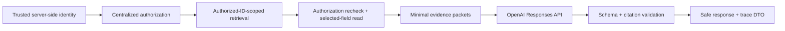

# Architecture

## Goal

Privato is a one-day, production-shaped MVP with a complete demonstration path. The architecture deliberately invests in the boundaries that protect sensitive information and avoids infrastructure that does not improve that path.

## Modules

- `app`: App Router pages and narrowly scoped route handlers
- `components`: presentation and client interaction
- `modules/identity`: session principal and demo identity provider
- `modules/authorization`: the single deterministic access policy
- `modules/resources`: authorization-sensitive resource application services
- `modules/documents`: replaceable encrypted document storage port
- `modules/encryption`: versioned AES-256-GCM implementation
- `modules/ai`: validated gateway ports, OpenAI provider, fallback, and runtime controls
- `modules/assistant`: authorization-scoped retrieval, evidence construction, grounded-answer orchestration, validation, and safe observability DTOs
- `modules/demo`: synthetic household fixture and infrastructure-free repository
- `db`: Drizzle schema, connection factory, and encrypted seed

## Request flows

### Protected resource read

```text
route
  -> resolve SessionPrincipal from DemoIdentityProvider
  -> locate non-sensitive resource index record
  -> assertResourceAccess (household + owner/rank policy)
  -> cross sensitive-read/decryption boundary
  -> render allowed resource OR identical unavailable state
```

### Insurance extraction

```text
browser upload
  -> server MIME + extension + size validation
  -> safe correlation ID and audit event
  -> AiGatewayPort
      -> OpenAI structured response OR demo fallback
      -> timeout / retry / circuit controls
  -> Zod validation
  -> editable review and visibility recommendation
  -> explicit user approval
  -> server assigns household and owner
```

The model recommends visibility but cannot save or authorize a resource.

### Ask Privato



`AskPrivatoService.execute` is a bounded single-turn use case. `DemoAuthorizedResourceRepository` calculates a fresh authorized ID set from the current server principal and current membership snapshot. `AuthorizedStructuredLexicalRetriever` can query only the corresponding approved search records. The service asserts the returned IDs, re-resolves and re-authorizes every selected candidate, then crosses `ResourceEncryptionPort` only for those candidates.

Evidence is limited to three sources, four relevant fields per source, bounded values, and a total serialized size limit. The model receives source IDs and public resource IDs, never internal database identifiers or authorization explanations. Every output is Zod-validated; every citation must exactly match supplied evidence and pass one more current-authorization lookup. Invalid citations are not filtered or partially accepted—they get one bounded correction attempt and then fail closed.

When retrieval produces no relevant authorized evidence, the service returns the same neutral no-answer message used for nonexistent information and does not invoke the answer model. This is the Sam/roadside fast path. The model never receives the household vault and is never asked to decide access.

## Persistence strategy

The default demo repository is stored on `globalThis` so state survives App Router requests within one process. This keeps the demonstration functional without PostgreSQL and makes its reset behavior explicit.

The Drizzle schema and SQL migrations define the persistence target with UUID keys, referential constraints, encrypted sensitive payload JSON, encrypted document bytes, audit events, safe AI-run fields, correlation and tenant indexes, and required constraints. `src/db/seed.ts` encrypts fields before database insertion.

The active Ask route records audit and AI-run aggregates in the in-process demo store. This includes actor and household IDs, authorized/candidate/source counts, answerable status, whether the answer model was invoked, provider/model, duration, retry/circuit state, token aggregates, outcome, and a safe error category. It never records questions, prompts, evidence, answers, or protected values. Durable PostgreSQL AI-run recording requires the not-yet-active database repository adapter.

A production follow-up would implement the existing repository and `DocumentStoragePort` boundaries against Drizzle, then remove the demo repository from runtime composition without changing UI policy code.

## AI runtime and ElectriPy

The official ElectriPy distribution inspected for this project is Python-only. The Next.js runtime cannot import it directly. `AiRuntimePort` and `AiGatewayPort` are therefore stable boundaries, while the active TypeScript `ResilientAiRuntime` supplies hard timeout, transient-only retry, exponential backoff with jitter, circuit behavior, and safe failure categorization. A supported ElectriPy Python service can be placed behind `AiRuntimePort` later. ElectriPy does not execute in the current Vercel runtime and the UI does not claim otherwise.

Operational metadata is intentionally small: correlation ID, operation, retrieval mode, authorized/candidate/source counts, answerable/model-invoked flags, model, provider, duration, outcome, retries, circuit state, token counts, and a safe error category. Sensitive request content is excluded.

## Retrieval scalability

The active adapter intentionally uses structured and lexical scoring over already-authorized, approved searchable metadata. It is reliable for the tiny household prototype corpus and avoids introducing pgvector without a deployed database capability. `AuthorizedRetrieverPort` is the replacement boundary for a future tenant-scoped embedding or PostgreSQL full-text implementation. Any future semantic adapter must apply household and authorized-resource filtering before ranking and must not store duplicate plaintext chunks.
